# repo-spector

    

 

**repo-spector** (a.k.a. [**self-reposcope**](https://github.com/4okimi7uki/self-reposcope)) is a reimagined Go-based implementation of the original Rust-based self-reposcope, featuring a renewed design and a migration from the GitHub REST API to GitHub GraphQL.

## Features

- 📊 Aggregate top languages across repositories
- 🔍 Inspect tech stacks via GitHub GraphQL
- ⚡ Fast, lightweight Go-based CLI

## Requirements

- Go 1.22 or later (recommended)
- GitHub Personal Access Token (set as `GH_TOKEN`)
  - The accessible repositories are determined by the token's scopes

<!--関連する語根 -spect を含む単語
また、「spector」という形ではありませんが、同じ語源を持つ一般的な単語には以下のようなものがあります。
inspect (インスペクト): 調査する、検査する (in- + spect = 中を見る)
expect (エクスペクト): 期待する、予期する (ex- + spect = 外を見る)
respect (リスペクト): 尊敬する、尊重する (re- + spect = 再び見る、顧みる)
suspect (サスペクト): 疑う、怪しいと思う (sus- + spect = 下から見る、見上げる)
perspective (パースペクティブ): 視点、見方、遠近法 (per- + spect = 通して見る)
aspect (アスペクト): 側面、様相 (a- + spect = の方を見る)
これらの単語は、いずれも「見る」という中心的な意味に関連しています。-->
